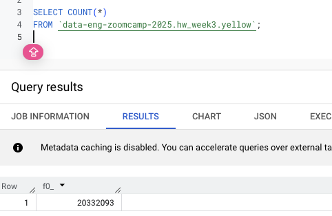
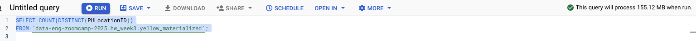
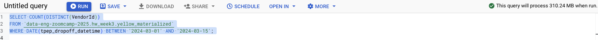
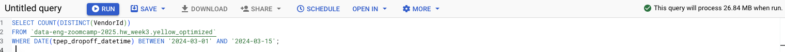

## Module 3 Homework

Data Warehousing using BigQuery

<b>BIG QUERY SETUP:</b></br>
Create an external table using the Yellow Taxi Trip Records. </br>
Create a (regular/materialized) table in BQ using the Yellow Taxi Trip Records (do not partition or cluster this table). </br>

```sql
CREATE OR REPLACE TABLE `data-eng-zoomcamp-2025.hw_week3.yellow_materialized` AS 

SELECT *
FROM `data-eng-zoomcamp-2025.hw_week3.yellow`;
```
</p>


## Question 1:
Question 1: What is count of records for the 2024 Yellow Taxi Data?
- 20,332,093

```sql
SELECT count(*) 
FROM `data-eng-zoomcamp-2025.hw_week3.yellow`
```



## Question 2:
Write a query to count the distinct number of PULocationIDs for the entire dataset on both the tables.</br> 
What is the **estimated amount** of data that will be read when this query is executed on the External Table and the Table?

- 0 MB for the External Table and 155.12 MB for the Materialized Table

```sql
SELECT COUNT(DISTINCT(PULocationID))
FROM `data-eng-zoomcamp-2025.hw_week3.yellow`;
```


```sql
SELECT COUNT(DISTINCT(PULocationID))
FROM `data-eng-zoomcamp-2025.hw_week3.yellow_materialized`;
```




## Question 3:
Write a query to retrieve the PULocationID from the table (not the external table) in BigQuery. Now write a query to retrieve the PULocationID and DOLocationID on the same table. Why are the estimated number of Bytes different?

- BigQuery is a columnar database, and it only scans the specific columns requested in the query. Querying two columns (PULocationID, DOLocationID) requires 
reading more data than querying one column (PULocationID), leading to a higher estimated number of bytes processed.

```sql
SELECT PULocationID
FROM `data-eng-zoomcamp-2025.hw_week3.yellow_materialized`;
```


```sql
SELECT PULocationID, DOLocationID
FROM `data-eng-zoomcamp-2025.hw_week3.yellow_materialized`;
```


## Question 4:
How many records have a fare_amount of 0?
- 8,333

```sql
SELECT count(*)
FROM `data-eng-zoomcamp-2025.hw_week3.yellow_materialized`
WHERE fare_amount = 0;
```


## Question 5:
What is the best strategy to make an optimized table in Big Query if your query will always filter based on tpep_dropoff_datetime and order the results by VendorID (Create a new table with this strategy)

- Partition by tpep_dropoff_datetime and Cluster on VendorID

```sql
CREATE OR REPLACE TABLE `data-eng-zoomcamp-2025.hw_week3.yellow_optimized` 
PARTITION BY DATE(tpep_dropoff_datetime)
CLUSTER BY VendorID
AS
SELECT *
FROM `data-eng-zoomcamp-2025.hw_week3.yellow_materialized`;
```


## Question 6:
Write a query to retrieve the distinct VendorIDs between tpep_dropoff_datetime
2024-03-01 and 2024-03-15 (inclusive)</br>

Use the materialized table you created earlier in your from clause and note the estimated bytes. Now change the table in the from clause to the partitioned table you created for question 5 and note the estimated bytes processed. What are these values? </br>

Choose the answer which most closely matches.</br> 

```sql
SELECT COUNT(DISTINCT(VendorId))
FROM `data-eng-zoomcamp-2025.hw_week3.yellow_materialized`
WHERE DATE(tpep_dropoff_datetime) BETWEEN '2024-03-01' AND '2024-03-15';
```




```sql
SELECT COUNT(DISTINCT(VendorId))
FROM `data-eng-zoomcamp-2025.hw_week3.yellow_optimized` 
WHERE DATE(tpep_dropoff_datetime) BETWEEN '2024-03-01' AND '2024-03-15';
```




- 310.24 MB for non-partitioned table and 26.84 MB for the partitioned table


## Question 7: 
Where is the data stored in the External Table you created?

- GCP Bucket

## Question 8:
It is best practice in Big Query to always cluster your data:

- True


## (Bonus: Not worth points) Question 9:
No Points: Write a `SELECT count(*)` query FROM the materialized table you created. How many bytes does it estimate will be read? Why?


## Submitting the solutions

Form for submitting: https://courses.datatalks.club/de-zoomcamp-2025/homework/hw3
